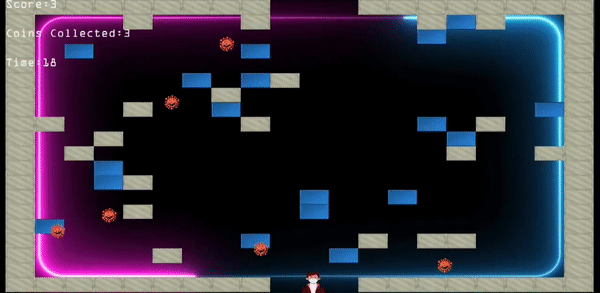

# Path-of-Exile

An innocent boy is trapped in a dungeon with virus all around him. Can you help him cross the levels while collecting the blue bricks which represent the currency in DungeonLand?
Here's a glimpse of the gameplay

    

## Controls

<kbd>↑</kbd> : Move up 
<kbd>←</kbd> : Move left 
<kbd>↓</kbd> : Move down 
<kbd>→</kbd> : Move right 
<kbd>Esc</kbd> - Quit 
<kbd>SPACE</kbd> - Toggle lights on and off 

## Rules

The dungeon consists of 3 levels, each harder than the previous one. Each level contains 4 outer walls with one sole exit, randomly generated inner walls and coins, and enemies that spawn in random positions. As you progress through the levels, the number of walls and enemies increases, making the game harder. If you come into contact with an enemy, you will die, and the game will be over. Complete all levels to win!

Bonus: 
You can toggle the lights to earn more coins! The lights are on by default, but if they are off, you will only be able to see walls, enemies and coins in a 1-unit radius. The value of coins collected when lights are off is twice their value when lights are on!

## Setup

1. Clone the repository.

2. Use the make command to compile the game.

3. Run the game using ``./game``
